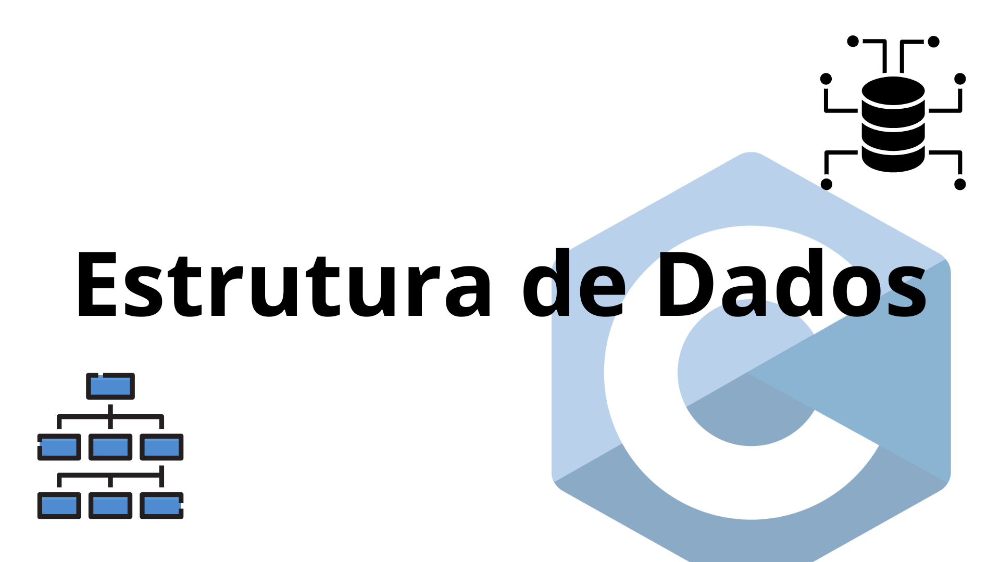

# Sumário:
- [Busca Sequencial](#módulo-sequential_search)
- [Busca Binária](#módulo-binary_search)
- [Algoritmos de Ordenação](#módulo-sorting_algorithms)
  - [Bubble Sort](#bubble-sort)
  - [Insertion Sort](#insertion-sort)
  - [Merge Sort](#merge-sort)
  - [Quick Sort](#quick-sort)
  - [Heap Sort](#heap-sort)
  - [Selection Sort](#selection-sort)
  - [Counting Sort](#counting-sort)
  - [Radix Sort](#radix-sort)
  - [Bucket Sort](#bucket-sort)


# Módulo sequential_search

### Descrição

A função `sequential_search` realiza uma busca linear no array, verificando cada elemento de forma sequencial até encontrar o `target` ou percorrer todo o array. Ela também conta o número de comparações feitas durante a execução da busca.

### Parâmetros da Função
  - `array[] (int[])`: Um array de inteiros no qual a busca será realizada.
  - `size (int)`: O tamanho do array.
  - `target (int)`: O número a ser buscado no array.
  - `comparisons (int *)`: Um ponteiro para uma variável inteira que será atualizada com o número de comparações feitas durante a execução da busca.

### Retorno
  - Índice do elemento encontrado: Se o elemento target for encontrado no array, a função retorna o índice do mesmo.
  - `-1`: Se o elemento não for encontrado, a função retorna -1.


# Módulo binary_search

### Descrição

A função `binary_search` realiza uma busca binária em um array de inteiros ordenado, retornando o índice do elemento buscado ou `-1` caso o elemento não seja encontrado. O número de comparações feitas durante a busca também é contado e retornado.

### Parâmetros da Função
  - `arr[] (int[])`: Um array de inteiros ordenado em ordem crescente.
  - `low (int)`: O índice inicial do array (geralmente 0).
  - `high (int)`: O índice final do array (geralmente size - 1).
  - `target (int)`: O número a ser buscado no array.
  - `comparisons (int *)`: Um ponteiro para uma variável inteira que será atualizada com o número de comparações feitas durante a execução da busca.

### Retorno
  - Índice do elemento encontrado: Se o elemento target for encontrado no array, a função retorna o índice do mesmo.
  - `-1`: Se o elemento não for encontrado, a função retorna -1.

# Módulo sorting_algorithms
Esse módulo implementa o **padrão de projeto Strategy** em C para ordenação de arrays. Que nos permite criar uma coleção de algoritmos, onde esses são isolados e podem ser substituído por outro com facilidade. No caso desse módulo, o padrão Strategy é usado para que possamos aplicar diferentes algoritmos de ordenação de forma mais modular e flexível. Em vez de fixar a ordenação de um jeito específico, o código oferece a possibilidade de escolher qual algoritmo de ordenação usar durante a execução.

#### Função `sort_array`
- A função `sort_array` recebe uma função de ordenação, permitindo que diferentes algoritmos de ordenação possam ser aplicados sem alterar o código principal, o array de inteiros e o tamanho do array.

#### Função `print_array`
-  A função `print_array` recebe o array de inteiros e seu tamanho como argumento.

## Bubble Sort
### Descrição
O algoritmo `bubble_sort` realiza a ordenação de um array. Caso nenhuma troca ocorra durante uma passagem, o algoritmo encerra a ordenação, evitando iterações desnecessárias.

### Parâmetros da função
  - `arr[]`: Array de inteiros a ser ordenado.
  - `n`: Tamanho do array.

### Retorno
Como é uma função do tipo void, não retorna nada, somente modifica o array de entrada.

## Insertion Sort
Em desenvolvimento...
## Merge Sort
Em desenvolvimento...
## Quick Sort
Em desenvolvimento...
## Heap Sort
Em desenvolvimento...
## Selection Sort
Em desenvolvimento...
## Counting Sort
Em desenvolvimento...
## Radix Sort
Em desenvolvimento...
## Bucket Sort
Em desenvolvimento...

# Exemplo de uso
Exemplos implementados na função `main` de cada arquivo.

### Como executar
Para compilar o código:
```bash
  gcc -o nome_do_arquivo arquivo.c
```
Para executar o programa:
```bash
 ./nome_do_arquivo
```


